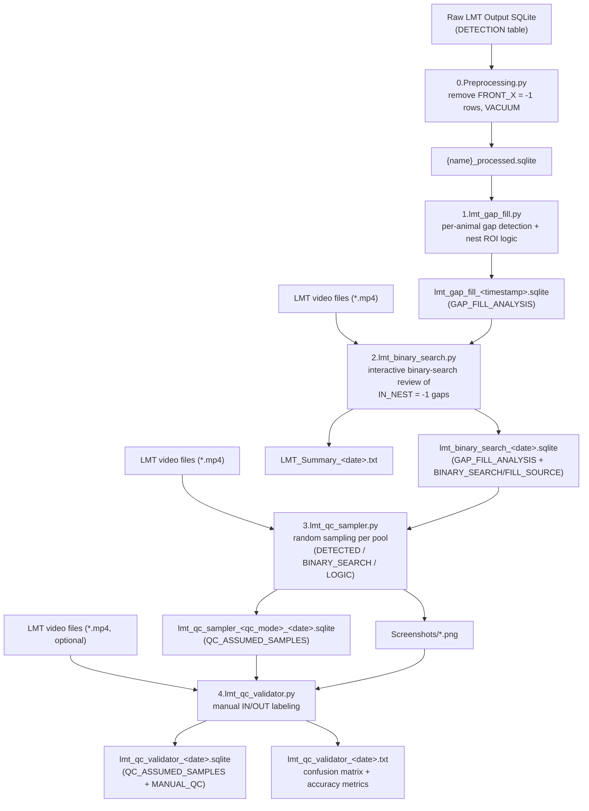

# LMT QC Pipeline Documentation

This README documents a 5-script pipeline that takes a Live Mouse Tracker (LMT)
SQLite output, cleans it, infers a mouse's in-nest/out-of-nest state for frames
where the tracker lost detection, resolves ambiguous gaps via a human-in-the-loop
binary-search video review, and then draws QC samples to measure the pipeline's
accuracy against human judgment.

Scripts: `0.Preprocessing.py`, `1.lmt_gap_fill.py`,
`2.lmt_binary_search.py`, `3.lmt_qc_sampler.py`, `4.lmt_qc_validator.py`.

---
# Script: `0.Preprocessing.py`

## Core Logic

This script creates a cleaned copy of a raw LMT Output SQLite database **without modifying the original file**. It removes invalid rows from the `DETECTION` table where:

```sql
FRONT_X = -1
```

After deletion, it runs `VACUUM` to reclaim disk space.

Before deleting any rows, the script validates the documented assumption that:

```text
FRONT_X = -1
```

also implies:

```text
FRONT_Y = -1
FRONT_Z = -1
BACK_X  = -1
BACK_Y  = -1
BACK_Z  = -1
```

If this assumption is violated, the script reports the number of mismatched rows and asks the user whether to continue.

Additional safety features include:

- Verifies that the `DETECTION` table exists before processing.
- Prevents accidental overwriting of an existing output file by requesting confirmation.
- Wraps all database operations in exception handling to ensure the SQLite connection is always closed.
- Uses a **Tkinter GUI** only (no command-line arguments).

---

# Inputs

| File Type | Purpose |
|-----------|---------|
| LMT Output SQLite (`.sqlite` / `.db`) | Raw LMT tracking database selected by the user. |

### SQLite Input Details

**Filename**

- User-selected (any valid filename).

**Required Table**

- `DETECTION`

The script checks `sqlite_master` to verify that this table exists. If it is missing, an error dialog is shown instead of allowing the script to crash.

**Columns Referenced**

| Column | Purpose |
|---------|---------|
| `FRONT_X` | Determines which rows are deleted (`FRONT_X = -1`). |
| `FRONT_Y` | Used only for assumption validation. |
| `FRONT_Z` | Used only for assumption validation. |
| `BACK_X` | Used only for assumption validation. |
| `BACK_Y` | Used only for assumption validation. |
| `BACK_Z` | Used only for assumption validation. |

The additional columns **do not affect which rows are deleted**.

**Other Database Objects**

Not determinable from the source code.

The script only executes:

- `sqlite_master` queries
- `COUNT(*)`
- `DELETE`
- `VACUUM`

It never inspects or modifies the remainder of the database schema.

---

# Outputs

| File Type | Purpose |
|-----------|---------|
| `{original_name}_processed{ext}` SQLite database | Cleaned copy of the input database with invalid `DETECTION` rows removed and disk space reclaimed. |

### SQLite Output Details

**Filename**

```text
{name}_processed{ext}
```

where:

- `name` = input filename without extension
- `ext` = original extension

The file is written to the user-selected output folder.

If the output file already exists, the user is prompted before overwriting it.

**Tables**

- Identical to the input database.

The database is first copied using `shutil.copy2()`, then modified in-place.

No new tables are created.

**Columns**

Identical to the input schema, except that rows matching the deletion criteria are removed.

The exact schema is not determined by the source code.

---

# Do **NOT** Modify

The following behaviors are relied upon by the processing workflow:

- The output naming convention

  ```text
  {name}_processed{ext}
  ```

  is **not required** by downstream scripts (Scripts 1–4 allow users to select any SQLite database), but users may rely on this naming convention.

- The deletion rule **must remain**

  ```sql
  FRONT_X = -1
  ```

  The newly added validation only checks data consistency—it **must not** alter the deletion criteria.

- The original database **must never be modified**. The script must always operate on a copied database so users can safely rerun preprocessing on the original file.

- If the user selects **No** at either:
  - the overwrite confirmation, or
  - the failed assumption validation,

  the script must terminate without producing a new output database.

---

# Open Source Notes

## Dependencies

### Python Standard Library

- `os`
- `shutil`
- `sqlite3`
- `time`
- `tkinter`

No third-party Python packages are required.

> **Linux Note:** `tkinter` is typically bundled with Python but may require installation of `python3-tk` on some Linux distributions.

---

## Configuration

- No configuration files
- No environment variables

---

## Directory Structure

No fixed directory structure is required.

Both the input database and output directory are selected interactively using file dialogs.

---

## Platform Assumptions

- Requires a desktop environment capable of displaying **Tkinter** windows.
- Not intended for headless execution.

`VACUUM` executes synchronously on the GUI thread.

For very large databases, the application window may appear temporarily unresponsive during this operation. This behavior is intentional and has not been changed, as making the process asynchronous would require introducing threading and significantly altering the execution model.
---

### Script: `1.lmt_gap_fill.py`

**Core Logic**
For a single animal (`ANIMALID`), reads all `DETECTION` rows ordered by frame
number, and for every pair of *consecutive* detected frames, determines whether
a gap (missing detections) exists between them. Detected frames are recorded
as `ASSUMPTION_TYPE = DETECTED` with their actual in-nest status (based on a
user-defined nest ROI). Missing frames within a gap are recorded as
`ASSUMPTION_TYPE = ASSUMED`, with `IN_NEST = 1` ("logic-filled") only if the
animal is in the nest at the gap's start **and** still within a looser nest
buffer ROI at the gap's end; otherwise `IN_NEST = -1` (uncertain, deferred to
binary search in script 2). Results are written to a new, timestamped SQLite
file.

**Inputs**

| File | Type | Purpose |
|---|---|---|
| LMT SQLite database (user-selected, typically the script 0 output) | SQLite database | Source of detection positions for the target animal. |

SQLite input details:
- **Filename**: user-selected, arbitrary.
- **Table used**: `DETECTION`
- **Columns used**: `FRAMENUMBER` (frame index), `MASS_X`, `MASS_Y` (animal
  centroid position), `ANIMALID` (filter criterion, supplied via GUI).
- Other columns: **Not determinable from code** (only these four are
  referenced/selected).

Additional (non-file) inputs via GUI: `Animal ID`, nest ROI
(`nest_xmin/xmax/ymin/ymax`), and nest buffer ROI
(`buffer_xmin/xmax/ymin/ymax`) — all user-entered numeric bounding boxes in the
same coordinate space as `MASS_X`/`MASS_Y`.

**Outputs**

| File | Type | Purpose |
|---|---|---|
| `lmt_gap_fill_<YYYY-MM-DD_HH-MM-SS>.sqlite` | SQLite database | Per-frame in-nest classification (detected + gap-filled/assumed) for the selected animal, feeding into script 2. |

SQLite output details:
- **Filename**: `lmt_gap_fill_<timestamp>.sqlite`
- **Table**: `GAP_FILL_ANALYSIS`
- **Columns**:
  - `FRAMENUMBER` (int) — frame index.
  - `IN_NEST` (int: `1`, `0`, or `-1`) — `1` = in nest, `0`/`-1` never assigned
    directly by this script for `DETECTED` rows other than the actual
    `in_roi()` result (`0` or `1`); for `ASSUMED` rows, `1` = logic-filled
    in-nest, `-1` = uncertain (needs binary search). Note: this script never
    writes a plain `0` for `ASSUMED` rows — only `1` or `-1`.
  - `ASSUMPTION_TYPE` (str: `"DETECTED"` or `"ASSUMED"`) — whether the frame
    was actually observed by LMT or filled in for a gap.
  - `GAP_START_FRAME` (int or `None`) — for `ASSUMED` rows, the last detected
    frame *before* the gap; `None` for `DETECTED` rows.
  - `GAP_END_FRAME` (int or `None`) — for `ASSUMED` rows, the first detected
    frame *after* the gap; `None` for `DETECTED` rows.

**Do NOT Modify**
- Downstream scripts (2, 3, 4) all assume the table name `GAP_FILL_ANALYSIS`
  and rely on the exact column names above (`FRAMENUMBER`, `IN_NEST`,
  `ASSUMPTION_TYPE`, `GAP_START_FRAME`, `GAP_END_FRAME`).
- The convention that `ASSUMED` rows only ever carry `IN_NEST` values of `1`
  or `-1` (never `0`) is depended upon by `2.lmt_binary_search.py`'s
  `df_neg = df[df["IN_NEST"] == -1]` selection and its downstream
  "logic_filled" vs. "binary-search input" accounting.
- The meaning of `GAP_START_FRAME`/`GAP_END_FRAME` (last detected frame
  before / first detected frame after the gap, **not** the first/last missing
  frame) is relied upon by script 2's gap grouping (`groupby(["GAP_START_FRAME","GAP_END_FRAME"])`) and its gap-type classification.
- Execution order: this script must run **after** row-invalidation
  preprocessing (script 0, or equivalent) and **before** `2.lmt_binary_search.py`.

**Open Source Notes**
- **External dependencies**: `pandas`, `tkinter`. Standard library: `os`,
  `sqlite3`, `datetime`.
- **Configuration files / environment variables**: none; all parameters
  (animal ID, ROI bounds) are entered via the GUI at runtime (with hardcoded
  defaults shown in the form).
- **Expected directory structure**: none required beyond an existing, writable
  output folder chosen via dialog.
- **Platform assumptions**: requires Tkinter GUI support (not headless-safe).

---

### Script: `2.lmt_binary_search.py`

**Core Logic**
Loads a `1.lmt_gap_fill.py` output and isolates all `ASSUMED` frames still
marked `IN_NEST = -1` (uncertain). Groups them into gaps, classifies each gap's
boundary type (`00`/`01`/`10`/`11` — out/in state before and after the gap),
and skips gaps that carry no directional information (`00`), are already
implicitly resolved (`11`), or are shorter than a configurable duration
threshold. Remaining gaps are queued for an interactive, GUI-driven binary
search: the reviewer is shown a three-panel view (last detected frame before
the gap, a candidate mid-point frame from the associated LMT video, and the
first detected frame after the gap) and answers "IN NEST" or "OUT OF NEST",
recursively narrowing the segment until the entry/exit point is resolved. Once
all gaps are processed, it writes a final classification for every frame
(with new `FILL_SOURCE`/`BINARY_SEARCH` bookkeeping columns) plus a detailed
plain-text summary report with multiple internal integrity checks.

**Inputs**

| File | Type | Purpose |
|---|---|---|
| `lmt_gap_fill_<date>.sqlite` (script 1 output) | SQLite database | Per-frame classification with unresolved (`IN_NEST = -1`) gaps to review. |
| One or more LMT video files (`*.mp4`) | Video | Source frames for the reviewer to visually classify in-nest/out-of-nest status. |

SQLite input details:
- **Filename**: user-selected (expected to be a `1.lmt_gap_fill.py` output).
- **Table**: `GAP_FILL_ANALYSIS`
- **Columns used**: `FRAMENUMBER`, `IN_NEST`, `ASSUMPTION_TYPE`,
  `GAP_START_FRAME`, `GAP_END_FRAME` (all columns are read via `SELECT *`).

Video input details:
- Any number of `.mp4` files; filenames are expected to encode a starting
  global frame number after a literal `"t"` character (parsed via
  `video_name.split("t")[1].split(".")[0]`), e.g. a name containing `..._t<start_frame>.mp4`. Exact required naming convention beyond this
  parse rule: **Not determinable from code**.
- Assumed frame-rate relationship: DB frames run at `DB_FPS = 30`; the supplied
  videos are assumed to be at half that rate (`FRAME_CONVERSION = 2`, i.e. 15fps),
  so `local_video_frame = (global_frame - video_start) / FRAME_CONVERSION`.

**Outputs**

| File | Type | Purpose |
|---|---|---|
| `lmt_binary_search_<YYYY-MM-DD>.sqlite` | SQLite database | Final per-frame in-nest classification with fill-method bookkeeping, for QC sampling in script 3. |
| `LMT_Summary_<YYYY-MM-DD>.txt` | Text report | Human-readable audit of detection counts, gap types, binary-search results, and internal balance/integrity checks. |
| `_binsearch_tmp/` (inside output folder) | Temp image cache | Scratch PNGs extracted from video during interactive review; deleted at successful completion. |

SQLite output details:
- **Filename**: `lmt_binary_search_<date>.sqlite`
- **Table**: `GAP_FILL_ANALYSIS`
- **Columns**:
  - `FRAMENUMBER` (int)
  - `IN_NEST` (int: `1`, `0`, or `-1`) — final classification; `-1` should only
    remain for frames the reviewer explicitly could not resolve/skipped
    (documented as "unexpected" if non-zero).
  - `ASSUMPTION_TYPE` (str: `"DETECTED"` or `"ASSUMED"`) — passed through from
    script 1.
  - `GAP_START_FRAME` / `GAP_END_FRAME` (int or `None`) — passed through from
    script 1.
  - `BINARY_SEARCH` (int: `0`/`1`) — `1` if this frame was routed to the
    interactive reviewer (a "searchable" frame), else `0`.
  - `FILL_SOURCE` (str: `"DETECTED"`, `"LOGIC"`, `"BINARY_SEARCH"`, or
    `"UNKNOWN"`) — which mechanism ultimately produced the frame's
    classification.

**Do NOT Modify**
- Table name `GAP_FILL_ANALYSIS` is reused (overwritten with new columns) —
  script 3 explicitly checks for a table named `GAP_FILL_ANALYSIS` first before
  falling back to a legacy `ASSUMED_FRAMES` name.
- The new columns `BINARY_SEARCH` and `FILL_SOURCE` (and their specific string
  values `"DETECTED"`/`"LOGIC"`/`"BINARY_SEARCH"`/`"UNKNOWN"`) are depended upon
  by both `3.lmt_qc_sampler.py`'s `filter_pool()` and
  `4.lmt_qc_validator.py`'s `load_database()` filtering logic (with legacy
  fallback paths if these columns are absent).
- Video filename convention (`..._t<start_frame>.mp4`) must match what
  `get_start_frame()` expects, or videos are silently dropped from the
  frame-resolution map.
- `DB_FPS = 30` / `FRAME_CONVERSION = 2` constants must match the actual
  recording/video frame rates; downstream scripts 3 and 4 duplicate these same
  constants and must be kept in sync manually.
- Execution order: must run **after** `1.lmt_gap_fill.py` and **before**
  `3.lmt_qc_sampler.py`. The completion dialog explicitly instructs: "Feed the
  SQLite into 3.lmt_qc_sampler.py."

**Open Source Notes**
- **External dependencies**: `opencv-python` (`cv2`), `pandas`, `Pillow`
  (`PIL.Image`, `PIL.ImageTk`), `tkinter`. Standard library: `os`, `copy`,
  `sqlite3`, `datetime`, `time`.
- **Configuration files / environment variables**: none; all thresholds
  (`MIN_GAP_DURATION_FOR_BINARY_SEARCH = 30s`,
  `FILL_ENTIRE_SEGMENT_IF_DURATION_LESS_THAN_IN_MINUTES = 1 min`, `DB_FPS`,
  `FRAME_CONVERSION`) are hardcoded module-level constants, not exposed via
  the GUI or a config file.
- **Expected directory structure**: none required beyond a writable output
  folder (a `_binsearch_tmp` subfolder is created automatically).
- **Platform assumptions**: requires Tkinter + a working OpenCV video backend;
  not headless-safe. Video codec support depends on the local OpenCV build.

---

### Script: `3.lmt_qc_sampler.py`

**Core Logic**
Loads a `2.lmt_binary_search.py` output (or a legacy equivalent), splits rows
into three QC "pools" — `DETECTED`, `BINARY_SEARCH`, or `LOGIC` — based on how
each frame's classification was produced, draws a random sample of a
user-specified size from each selected pool, extracts the corresponding video
frame as a screenshot, and records everything in a new SQLite table for manual
review in script 4.

**Inputs**

| File | Type | Purpose |
|---|---|---|
| `lmt_binary_search_<date>.sqlite` (script 2 output) | SQLite database | Fully classified per-frame data to draw QC samples from. |
| One or more LMT video files (`*.mp4`) | Video | Source of the screenshot images captured for each sampled frame. |

SQLite input details:
- **Filename**: user-selected (expected to be a `2.lmt_binary_search.py`
  output; falls back to legacy naming if needed).
- **Table**: `GAP_FILL_ANALYSIS` (preferred) or legacy `ASSUMED_FRAMES` (used
  if `GAP_FILL_ANALYSIS` is not found in the file).
- **Columns used**: `FRAMENUMBER`, `IN_NEST`, `ASSUMPTION_TYPE`,
  `FILL_SOURCE` (optional/new), `BINARY_SEARCH` (optional/legacy),
  `GAP_START_FRAME`, `GAP_END_FRAME`.

Video input details: same naming convention and frame-rate assumptions as
script 2 (`DB_FPS = 30`, `FRAME_CONVERSION = 2`).

Additional (non-file) GUI inputs: `Animal ID`, number of samples per pool, and
which of the three pools (`DETECTED`/`BINARY_SEARCH`/`LOGIC`) to sample.

**Outputs**

| File | Type | Purpose |
|---|---|---|
| `lmt_qc_sampler_<qc_mode>_<YYYY-MM-DD>.sqlite` (one per selected pool) | SQLite database | Metadata for the drawn QC sample, consumed by script 4. |
| `Screenshots/S####_A<animal_id>_G<frame>_<video>.png` | PNG image | Extracted video frame for each sampled row. |

Output folder structure: `output_folder/{qc_mode}_{timestamp}/` containing the
SQLite file directly, and a `Screenshots/` subfolder with the PNGs.

SQLite output details:
- **Filename**: `lmt_qc_sampler_<qc_mode>_<date>.sqlite`
- **Table**: `QC_ASSUMED_SAMPLES`
- **Columns**:
  - `sample_id` (int) — 1-based counter, also embedded in the screenshot
    filename.
  - `animal_id` (int) — animal ID entered by the user.
  - `video` (str) — basename of the video file the screenshot was extracted
    from.
  - `frame_global` (int) — the actual (possibly nearest-neighbor-resolved)
    global frame number captured.
  - `requested_frame` (int) — the originally sampled `FRAMENUMBER` before any
    nearest-frame resolution.
  - `IN_NEST` (int: `1`/`0`/`-1`) — classification carried over from the
    source row.
  - `ASSUMPTION_TYPE` (str) — `"DETECTED"` or `"ASSUMED"`, carried over.
  - `FILL_SOURCE` (str) — carried over if present in source, else defaults to
    the requested `qc_mode`.
  - `GAP_START_FRAME` / `GAP_END_FRAME` (int or `None`) — carried over; only
    populated for `ASSUMED` rows.
  - `screenshot` (str) — filename of the extracted PNG (relative to the
    `Screenshots/` folder).
  - `QC_MODE` (str: `"DETECTED"`/`"BINARY_SEARCH"`/`"LOGIC"`) — which pool this
    sample belongs to; read by script 4 to determine filtering/display logic.

**Do NOT Modify**
- Table name `QC_ASSUMED_SAMPLES` and all listed column names are required by
  `4.lmt_qc_validator.py`'s `load_database()`.
- The `QC_MODE` value written to every row must be one of the three literal
  strings `DETECTED`/`BINARY_SEARCH`/`LOGIC` — script 4 reads the value from
  the *first row only* (`df_full["QC_MODE"].iloc[0]`) to decide the filtering
  mode for the entire file, so a mixed-mode file is not supported.
- The screenshot filename format
  (`S{counter:04d}_A{animal_id}_G{resolved_frame}_{video_name}.png`) must
  remain resolvable relative to the `Screenshots/` subfolder for script 4 to
  locate images (`os.path.join(screenshot_folder, screenshot_nm)`), where
  `screenshot_folder` is the folder the user points script 4 at.
- Execution order: must run **after** `2.lmt_binary_search.py` and **before**
  `4.lmt_qc_validator.py`.

**Open Source Notes**
- **External dependencies**: `opencv-python` (`cv2`), `pandas`, `tkinter`.
  Standard library: `os`, `sqlite3`, `datetime`.
- **Configuration files / environment variables**: none; `DB_FPS`,
  `FRAME_CONVERSION`, and the three `QC_MODE_*` constants are hardcoded and
  duplicated from script 2.
- **Expected directory structure**: creates
  `{output_folder}/{qc_mode}_{timestamp}/Screenshots/` automatically.
- **Platform assumptions**: requires Tkinter + OpenCV; not headless-safe.

---

### Script: `4.lmt_qc_validator.py`

**Core Logic**
Loads a `3.lmt_qc_sampler.py` output, determines the active QC mode from the
`QC_MODE` column (with legacy fallbacks), filters to the eligible rows for that
mode, and presents each sampled screenshot (plus, for `ASSUMED`-type modes, the
gap's before/after boundary frames re-extracted from video) to a human reviewer
for manual "IN NEST"/"OUT OF NEST" labeling. Saves progress after every label,
and on completion computes a two-class confusion matrix (algorithm prediction
= `IN_NEST` vs. human ground truth = `MANUAL_QC`) and writes a text validation
report.

**Inputs**

| File | Type | Purpose |
|---|---|---|
| `lmt_qc_sampler_<qc_mode>_<timestamp>.sqlite` (script 3 output) | SQLite database | The drawn QC sample to be manually labeled. |
| Screenshot folder | Directory of PNGs | Location of the images referenced by the `screenshot` column. |
| LMT video files (`*.mp4`, optional) | Video | If provided, enables re-extracting the gap's before/after boundary frames for a three-panel review display. |

SQLite input details:
- **Filename**: user-selected (expected to be a `3.lmt_qc_sampler.py` output).
- **Table**: `QC_ASSUMED_SAMPLES`
- **Columns used**: `screenshot`, `video`, `frame_global`, `IN_NEST`,
  `ASSUMPTION_TYPE`, `FILL_SOURCE` (optional), `BINARY_SEARCH` (optional,
  legacy), `GAP_START_FRAME`, `GAP_END_FRAME`, `QC_MODE` (optional — absence
  implies the legacy `"ASSUMED"` mode), `MANUAL_QC` (added by this script if
  absent).

**Outputs**

| File | Type | Purpose |
|---|---|---|
| `lmt_qc_validator_<YYYY-MM-DD>.sqlite` (written into the screenshot folder) | SQLite database | The same sample table with human labels (`MANUAL_QC`) recorded; saved after every label for durability. |
| `lmt_qc_validator_<YYYY-MM-DD>.txt` (written into the screenshot folder) | Text report | Confusion matrix and accuracy/error-rate/sensitivity/specificity metrics, plus lists of false-positive/false-negative screenshot filenames. |

SQLite output details:
- **Filename**: `lmt_qc_validator_<date>.sqlite`
- **Table**: `QC_ASSUMED_SAMPLES`
- **Columns**: identical to the script 3 output table, plus:
  - `MANUAL_QC` (nullable int: `1` = human says IN NEST, `0` = human says OUT
    OF NEST, `null`/`NaN` = not yet labeled).

**Do NOT Modify**
- This is the terminal script in the pipeline; nothing downstream consumes its
  output within this repository, but its report format (TP/FP/TN/FN, accuracy,
  error rate, sensitivity, specificity) is the pipeline's accuracy measurement
  and should be treated as the canonical QC metric definition.
- Relies on the `QC_MODE` value from the **first row** of the loaded table to
  choose the filter/display logic for the entire session — files must not mix
  QC modes.
- Relies on the `screenshot` column values being resolvable as
  `os.path.join(screenshot_folder, screenshot_nm)` — the user must point this
  script at the same folder script 3 wrote screenshots into (the `Screenshots/`
  subfolder), not the parent pool folder.
- Boundary/three-panel display for `ASSUMED`-type modes requires
  `GAP_START_FRAME`/`GAP_END_FRAME` to be present and non-null, and requires
  videos to be loaded; otherwise it silently falls back to single-panel display
  of the pre-extracted screenshot.

**Open Source Notes**
- **External dependencies**: `opencv-python` (`cv2`), `pandas`, `Pillow`
  (`PIL.Image`, `PIL.ImageTk`), `tkinter`. Standard library: `os`, `sqlite3`,
  `datetime`, `tempfile`, `uuid`.
- **Configuration files / environment variables**: none; `DB_FPS`,
  `FRAME_CONVERSION`, and QC mode constants are hardcoded and duplicated from
  scripts 2/3.
- **Expected directory structure**: expects the screenshot folder produced by
  script 3 (i.e., the `Screenshots/` subfolder, or wherever the `screenshot`
  filenames are resolvable relative to).
- **Platform assumptions**: requires Tkinter + OpenCV; uses the OS temp
  directory (`tempfile.gettempdir()`) for scratch boundary-frame images; not
  headless-safe.

---

## 3. Workflow Summary

**Execution order**

1. `0.Preprocessing.py` — clean raw LMT SQLite (remove invalid detections).
2. `1.lmt_gap_fill.py` — classify detected frames + logic-fill/flag gaps per animal.
3. `2.lmt_binary_search.py` — human-in-the-loop resolution of ambiguous gaps via video.
4. `3.lmt_qc_sampler.py` — draw random QC samples per pool + extract screenshots.
5. `4.lmt_qc_validator.py` — manual labeling of QC samples + accuracy metrics.

**Workflow diagram**



**Data flow between scripts**

- Script 0 → Script 1: cleaned `DETECTION` table (copy of raw LMT SQLite,
  minus invalid rows).
- Script 1 → Script 2: `GAP_FILL_ANALYSIS` table (`FRAMENUMBER`, `IN_NEST`,
  `ASSUMPTION_TYPE`, `GAP_START_FRAME`, `GAP_END_FRAME`); consumed alongside
  the raw LMT video files.
- Script 2 → Script 3: updated `GAP_FILL_ANALYSIS` table (same columns +
  `BINARY_SEARCH`, `FILL_SOURCE`); consumed alongside the same LMT video files.
- Script 3 → Script 4: `QC_ASSUMED_SAMPLES` table + a `Screenshots/` folder of
  PNGs; video files are optional input to script 4 (only needed for the
  three-panel boundary view).

**Intermediate files/databases produced**
- `{name}_processed.sqlite` (script 0)
- `lmt_gap_fill_<timestamp>.sqlite` (script 1)
- `lmt_binary_search_<date>.sqlite` + `LMT_Summary_<date>.txt` + transient
  `_binsearch_tmp/` cache (script 2)
- `lmt_qc_sampler_<qc_mode>_<date>.sqlite` + `Screenshots/*.png` (script 3, one
  set per selected pool)

**Final outputs**
- `lmt_qc_validator_<date>.sqlite` — QC sample table with human labels
  (`MANUAL_QC`).
- `lmt_qc_validator_<date>.txt` — final accuracy report (confusion matrix,
  accuracy, error rate, sensitivity, specificity) plus lists of false-positive
  and false-negative screenshots for review.
