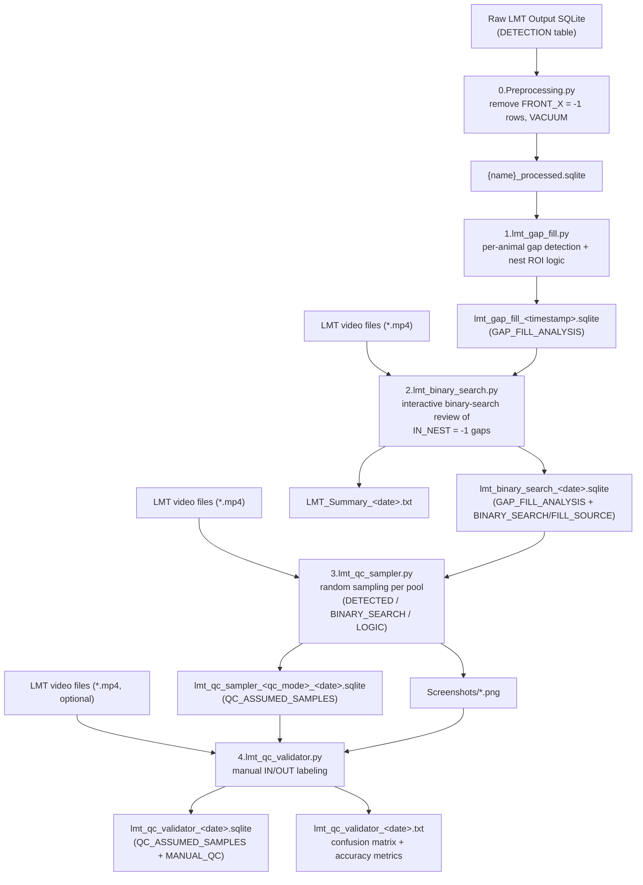

# LMT QC Pipeline Documentation

This README documents a 5-script pipeline that takes a Live Mouse Tracker (LMT)
SQLite output, cleans it, infers a mouse's in-nest/out-of-nest state for frames
where the tracker lost detection, resolves ambiguous gaps via a human-in-the-loop
binary-search video review, and then draws QC samples to measure the pipeline's
accuracy against human judgment.

Scripts: `0.Preprocessing.py`, `1.lmt_gap_fill.py`,
`2.lmt_binary_search.py`, `3.lmt_qc_sampler.py`, `4.lmt_qc_validator.py`.

---
## Script: `0.Preprocessing.py`

### Overview
This script creates a cleaned copy of a raw LMT Output SQLite database **without modifying the original file**. It removes invalid rows from the `DETECTION` table where:

```sql
FRONT_X = -1
```

After deletion, it runs `VACUUM` to reclaim disk space.

Before deleting any rows, the script validates the documented assumption that:

```text
FRONT_X = -1
```

also implies:

```text
FRONT_Y = -1
FRONT_Z = -1
BACK_X  = -1
BACK_Y  = -1
BACK_Z  = -1
```

If this assumption is violated, the script reports the number of mismatched rows and asks the user whether to continue.

Additional safety features include:

- Verifies that the `DETECTION` table exists before processing.
- Prevents accidental overwriting of an existing output file by requesting confirmation.
- Wraps all database operations in exception handling to ensure the SQLite connection is always closed.

### Inputs
- LMT Output SQLite
  - Table `DETECTION`
    - Columns
      - `FRONT_X` (Determines which rows are deleted)
      - `FRONT_Y` (Used only for assumption validation)
      - `FRONT_Z` (Used only for assumption validation)
      - `BACK_X` (Used only for assumption validation)
      - `BACK_Y` (Used only for assumption validation)
      - `BACK_Z` (Used only for assumption validation))
- Output folder path

### Outputs
- `{original_name}_processed.sqlite` 

---

## Script: `1.lmt_gap_fill.py`

### Overview
This script processes detection data for a single animal (`ANIMALID`) and fills gaps between consecutive detections using rule-based logic.

For every pair of consecutive detected frames:

- Determines whether missing frames (a gap) exist.
- Records detected frames as `ASSUMPTION_TYPE = "DETECTED"` using their actual in-nest status based on the user-defined nest ROI.
- Records missing frames as `ASSUMPTION_TYPE = "ASSUMED"`.

For assumed frames:

- `IN_NEST = 1` (logic-filled) only if
  - the animal is inside the nest ROI at the start of the gap **and**
  - remains inside the larger nest buffer ROI at the end of the gap.
- Otherwise:
  - `IN_NEST = -1` (uncertain), allowing `2.lmt_binary_search.py` to resolve the gap using binary search.

Results are written to a new SQLite database.

### Inputs
- `{original_name}_processed.sqlite`
  - Table `DETECTION`
    - Columns
      - `FRAMENUMBER`
      - `MASS_X`
      - `MASS_Y`
      - `ANIMALID`
- Animal ID (integer)
- Nest ROI: xmin, xmax, ymin, ymax (float)
- Buffer ROI: xmin, xmax, ymin, ymax (float) (must be larger than the nest ROI)
- Output folder path

### Outputs
- `lmt_gap_fill_<YYYY-MM-DD_HH-MM-SS>.sqlite`
  - Table `GAP_FILL_ANALYSIS`
    - Columns
      - `FRAMENUMBER`
      - `IN_NEST` (1 = in nest, 0 = out of nest (detected rows), -1 = uncertain)
      - `ASSUMPTION_TYPE` ("DETECTED" / "ASSUMED")
      - `GAP_START_FRAME` (Last detected frame before a gap (NULL for detected rows))
      - `GAP_END_FRAME` (First detected frame after a gap (NULL for detected rows))

### Assumed Frame Convention
`ASSUMED` rows must only contain:

- `IN_NEST = 1`
- `IN_NEST = -1`

They must **never** contain `0`.

`2.lmt_binary_search.py` relies on this convention when selecting:

```python
df_neg = df[df["IN_NEST"] == -1]
```

### Gap Boundary Meaning
The following definitions must remain unchanged:

- `GAP_START_FRAME` = last detected frame before the gap
- `GAP_END_FRAME` = first detected frame after the gap

`2.lmt_binary_search.py` depends on these definitions for gap grouping and classification.

### Do Not Modify
- ROI test uses strict inequality (`<`, not `<=`), changing to `<=` alters boundary behaviour
- `IN_NEST = −1` must remain −1; downstream scripts (`2.lmt_binary_search.py`, `4.lmt_qc_validator.py`) filter on this exact value
- Table name `GAP_FILL_ANALYSIS` is hardcoded in 2.lmt_binary_search.py's read query

---

## Script: 2.lmt_binary_search.py

### Overview
Loads a `1.lmt_gap_fill.py` output and isolates all ASSUMED frames still marked IN_NEST = -1 (uncertain). Groups them into gaps, classifies each gap's boundary type (00/01/10/11), and skips gaps that carry no directional information (00), are already implicitly resolved (11), or are shorter than a configurable duration threshold. Remaining gaps are queued for an interactive, GUI-driven binary search: the reviewer is shown a three-panel view and answers "IN NEST" or "OUT OF NEST," recursively narrowing the segment until the entry/exit point is resolved. Once all gaps are processed, it writes a final classification for every frame (with FILL_SOURCE/BINARY_SEARCH bookkeeping columns) plus a detailed plain-text summary report with multiple internal integrity checks.

### Inputs
- `lmt_gap_fill_<date>.sqlite` (If a gap's GAP_START_FRAME/GAP_END_FRAME does not correspond to a detected FRAMENUMBER, or a detected frame's IN_NEST value is anything other than 0/1, gap classification raises a clear "Data Integrity Error" dialog)
- LMT output video files (.mp4) (Same naming convention and frame-rate assumptions as `1.lmt_gap_fill.py`)
- Output folder path

### Outputs
- `lmt_binary_search_<YYYY-MM-DD>.sqlite`
  - Table `GAP_FILL_ANALYSIS`
    - Columns
      - `FRAMENUMBER` 
      - `IN_NEST` (1 = in nest, 0 = out of nest, -1 = 00 gaps, shorter than configurable duration threshold)
      - `ASSUMPTION_TYPE` ("DETECTED" / "ASSUMED")
      - `GAP_START_FRAME` (Last detected frame before a gap (NULL for detected rows))
      - `GAP_END_FRAME` (First detected frame after a gap (NULL for detected rows))
      - `BINARY_SEARCH` (0 (Binary search was not performed) / 1 (Binary search was performed))
      - `FILL_SOURCE` ("DETECTED" / "LOGIC" / "BINARY_SEARCH" / "UNKNOWN")
- `LMT_Summary_<YYYY-MM-DD>.txt`
- `_binsearch_tmp/` (Temp image cache; Scratch PNGs extracted from video during interactive review; Deleted at successful completion (or) if the window is closed early)

### Do NOT Modify
- `DB_FPS = 30` and `FRAME_CONVERSION = 2`: these encode the relationship between the LMT database frame rate (30 fps) and the video frame rate (15 fps), wrong values would extract the wrong frames
- Video filename parsing in `get_start_frame()` assumes the pattern `...t<int>.<ext>`, any other naming convention will break video-to-frame mapping
- `BINARY_SEARCH = 1` is set only for frames in searchable gaps (above threshold), this distinction is used by 4.lmt_qc_validator.py

### Open Source Notes

#### External dependencies
External dependencies: opencv-python (cv2), numpy (newly required by this update for vectorized classification), pandas, Pillow (PIL.Image, PIL.ImageTk), tkinter.

Standard library: os, re (newly used for robust filename parsing), copy, sqlite3, datetime, time.

#### Configuration files / environment variables
Configuration files / environment variables: none; all thresholds (MIN_GAP_DURATION_FOR_BINARY_SEARCH = 30s, FILL_ENTIRE_SEGMENT_IF_DURATION_LESS_THAN_IN_MINUTES = 1 min, DB_FPS, FRAME_CONVERSION, and the new FPS_TOLERANCE = 0.5) are hardcoded module-level constants, not exposed via the GUI or a config file.

#### Expected directory structure
Expected directory structure: none required beyond a writable output folder (a _binsearch_tmp subfolder is created automatically, and is now also cleaned up on early window close).

#### Platform assumptions
Platform assumptions: requires Tkinter + a working OpenCV video backend; not headless-safe. Video codec support depends on the local OpenCV build.

Video files are now kept open (cached) for the duration of the review session rather than being reopened per frame — on platforms/filesystems with a low limit on simultaneously open file handles, reviewing a very large number of distinct video files in one session could approach that limit (previously each file was opened and closed immediately, avoiding this, at the cost of much slower repeated re-opening).

---

## Script: `3.lmt_qc_sampler.py`

### Overview
Loads a `2.lmt_binary_search.py` output (or a legacy equivalent), splits rows into three QC "pools" — `DETECTED`, `BINARY_SEARCH`, or `LOGIC` — based on how each frame's classification was produced, draws a random sample of a user-specified size from each selected pool, extracts the corresponding video frame as a screenshot, and records everything in a new SQLite table for manual review in `4.lmt_qc_validator.py`.

### Inputs
- `lmt_binary_search_<date>.sqlite`
- LMT output video files (.mp4) (Same naming convention and frame-rate assumptions as `2.lmt_binary_search.py`)
- Output folder path
- Animal ID (integer)
- Sample count (integer, applied independently to each selected QC type)
- QC type selections: `DETECTED rows`, `BINARY_SEARCH rows`, `LOGIC rows'

### Outputs
- Per selected type:
    - `lmt_qc_sampler_<qc_mode>_<YYYY-MM-DD>.sqlite`
        - Table `QC_ASSUMED_SAMPLES`
            - Columns
              - `sample_id` 
              - `animal_id` 
              - `video`
              - `frame_global` (the actual (possibly nearest-neighbor-resolved) global frame number captured)
              - `requested_frame` (the originally sampled `FRAMENUMBER` before any nearest-frame resolution)
              - `IN_NEST` (1 = in nest, 0 = out of nest, -1 = 00 gaps, shorter than configurable duration threshold)
              - `ASSUMPTION_TYPE` ("DETECTED" / "ASSUMED")
              - `FILL_SOURCE` ("DETECTED" / "LOGIC" / "BINARY_SEARCH" / "UNKNOWN")
              - `GAP_START_FRAME` (Last detected frame before a gap (NULL for detected rows))
              - `GAP_END_FRAME` 
              - `screenshot` (filename of the extracted PNG (relative to the `Screenshots/` folder))
              - `QC_MODE` ("DETECTED" / "BINARY_SEARCH" / "LOGIC")
      - `Screenshots/`   

### Do NOT Modify
- Table name `QC_ASSUMED_SAMPLES` and all listed column names are required by `4.lmt_qc_validator.py`'s `load_database()`.
- The screenshot filename format (`S{counter:04d}_A{animal_id}_G{resolved_frame}_{video_name}.png`) must remain resolvable relative to the `Screenshots/` subfolder for `4.lmt_qc_validator.py` to locate images (`os.path.join(screenshot_folder, screenshot_nm)`), where `screenshot_folder` is the folder the user points `4.lmt_qc_validator.py` at.

### Open Source Notes

#### External dependencies
- `opencv-python` (`cv2`), `pandas`, `tkinter`
- Standard library: `os`, `sqlite3`, `datetime`

#### Configuration files / environment variables
- None
- `DB_FPS`, `FRAME_CONVERSION`, and the three `QC_MODE_*` constants are hardcoded and duplicated from `2.lmt_binary_search.py`.

#### Expected directory structure
- Creates `{output_folder}/{qc_mode}_{timestamp}/Screenshots/` automatically.

#### Platform assumptions
- Requires Tkinter + OpenCV; not headless-safe.

---

## Script: `4.lmt_qc_validator.py`

### Overview 
Loads a `3.lmt_qc_sampler.py` output, determines the active QC mode from the `QC_MODE` column (with legacy fallbacks), filters to the eligible rows for that mode, and presents each sampled screenshot (plus, for `ASSUMED`-type modes, the gap's before/after boundary frames re-extracted from video) to a human reviewer for manual "IN NEST"/"OUT OF NEST" labeling. Saves progress after every label, and on completion computes a two-class confusion matrix (algorithm prediction = `IN_NEST` vs. human ground truth = `MANUAL_QC`) and writes a text validation report.

### Inputs
- `lmt_qc_sampler_<qc_mode>_<YYYY-MM-DD>.sqlite`
- `Screenshots/`
- LMT output video files (.mp4) (Same naming convention and frame-rate assumptions as `3.lmt_qc_validator.py`)

### Outputs
- `lmt_qc_validator_<YYYY-MM-DD>.sqlite`
    - Table `QC_ASSUMED_SAMPLES`
        - Columns
          - `sample_id` 
          - `animal_id` 
          - `video`
          - `frame_global` (the actual (possibly nearest-neighbor-resolved) global frame number captured)
          - `requested_frame` (the originally sampled `FRAMENUMBER` before any nearest-frame resolution)
          - `IN_NEST` (1 = in nest, 0 = out of nest, -1 = 00 gaps, shorter than configurable duration threshold)
          - `ASSUMPTION_TYPE` ("DETECTED" / "ASSUMED")
          - `FILL_SOURCE` ("DETECTED" / "LOGIC" / "BINARY_SEARCH" / "UNKNOWN")
          - `GAP_START_FRAME` (Last detected frame before a gap (NULL for detected rows))
          - `GAP_END_FRAME` 
          - `screenshot` (filename of the extracted PNG (relative to the `Screenshots/` folder))
          - `QC_MODE` ("DETECTED" / "BINARY_SEARCH" / "LOGIC")
          - `MANUAL_QC` (1 = human says IN NEST, 0 = human says OUT OF NEST, null/NaN = not yet labeled)
- `lmt_qc_validator_<YYYY-MM-DD>.txt` 

### Do NOT Modify
- This is the terminal script in the pipeline; nothing downstream consumes its output within this repository, but its report format (TP/FP/TN/FN, accuracy, error rate, sensitivity, specificity) is the pipeline's accuracy measurement and should be treated as the canonical QC metric definition.
- Relies on the `QC_MODE` value from the **first row** of the loaded table to choose the filter/display logic for the entire session — files must not mix QC modes.
- Relies on the `screenshot` column values being resolvable as `os.path.join(screenshot_folder, screenshot_nm)` — the user must point this script at the same folder script 3 wrote screenshots into (the `Screenshots/` subfolder), not the arent pool folder.
- Boundary/three-panel display for `ASSUMED`-type modes requires `GAP_START_FRAME`/`GAP_END_FRAME` to be present and non-null, and requires videos to be loaded; otherwise it silently falls back to single-panel display of the pre-extracted screenshot.

### Open Source Notes

#### External dependencies
- `opencv-python` (`cv2`), `pandas`, `Pillow` (`PIL.Image`, `PIL.ImageTk`), `tkinter`. Standard library: `os`, `sqlite3`, `datetime`, `tempfile`, `uuid`.

#### Configuration files / environment variables**
- None
- `DB_FPS`, `FRAME_CONVERSION`, and QC mode constants are hardcoded and duplicated from `2.lmt_binary_search.py`/`3.lmt_qc_sampler.py`.

#### Expected directory structure
- Expects the screenshot folder produced by `3.lmt_qc_sampler.py` (i.e., the `Screenshots/` subfolder, or wherever the `screenshot`filenames are resolvable relative to).
  
#### Platform assumptions
- requires Tkinter + OpenCV
- Uses the OS temp directory (`tempfile.gettempdir()`) for scratch boundary-frame images
- Not headless-safe.

---

## Workflow Summary

### Execution order

1. `0.Preprocessing.py`: clean raw LMT SQLite (remove invalid detections).
2. `1.lmt_gap_fill.py`: classify detected frames + logic-fill/flag gaps per animal.
3. `2.lmt_binary_search.py`: human-in-the-loop resolution of ambiguous gaps via video.
4. `3.lmt_qc_sampler.py`: draw random QC samples per pool + extract screenshots.
5. `4.lmt_qc_validator.py`: manual labeling of QC samples + accuracy metrics.

**Workflow diagram**


